# Оглавление
- [🏖 MySite](#🏖-MySite)
    - [Настройка и запуск](#Настройка-и-запуск)
    - [Ограничения](#Ограничения)
    - [Приложение `🏖 MySite`](#Приложение-MySite)

# 🏖 MySite 
Данный проект предназначен для упрощения поиска и получения информации о туристических местах, которые также могут быть отфильтрованы по категориям

> ### [_Ссылка на демонстрацию проекта_](https://amel-tourism.herokuapp.com/)

## Настройка и запуск
1. Разархивируйте приложенный архив следующим образом (Исключая папку **venv**):

   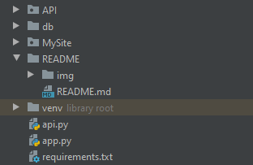
   
2. Установка зависимостей из **requirements.txt:** 

    `pip install -r requirements.txt`
    
3. Перед тем, как начать пользоваться приложением, нужно инициализировать базу данных:

    * Откройте консоль
        
    
        
    * Инициализируйте базу данных командой `flask db init`
    * Сгенерируйте начальную миграцию командой `flask db migrate -m "Initial migration."` 
        * Аргумент `-m` указывает сообщение при миграции
    * Примените миграцию к базе данных командой `flask db upgrade`
    * Готово!
    
4. Запуск приложений через консоль:
    * Запуск основного приложения: 
    
            python app.py
            
    * Запуск API-приложения: 
    
            python api.py
    
5. Остановить приложение в консоли можно, нажав комбинацию клавиш `CTRL + C`

6. Получение админки:
   * Перейдите на главное приложение и зарегистрируйтесь 
   (нажмите сначала на кнопку `войти`, а затем в форме на `зарегистрироваться`)
   * Готово!
   
## Ограничения
1. На сайте используется виджет VK-комментариев, который запрещается использовать на `localhost`. Данный виджет можно посмотреть [на демонстрации](https://amel-tourism.herokuapp.com/).
2. Изображения загружаются на хостинг `Imgur`, поэтому приложение на `localhost'e` не будет прогружать их. Исправно работает [на демонстрации](https://amel-tourism.herokuapp.com/), т.к. сервер находится в США.

    > При публикации статьи изображения в любом случае будут загружаться на хостинг `Imgur` и фиксироваться в базе данных.   
                                                                                                                                                                                                                                                                                                                                                                                                                                
3. Ссылки на сторонние ресурсы заменил на #, потому что проект презентуется по одной теме.
4. При инициализации базы данных в таблице `articles` нет никаких статей, поэтому будет показываться ошибка 404. 

    > В любом слуае админ сможет добавить статью (см рис. ниже: пункт "Добавить статью"), **но перед этим нужно добавить хотя бы одну категорию**
                                                                                                                     
## Приложение MySite
1. Разделы сайта

    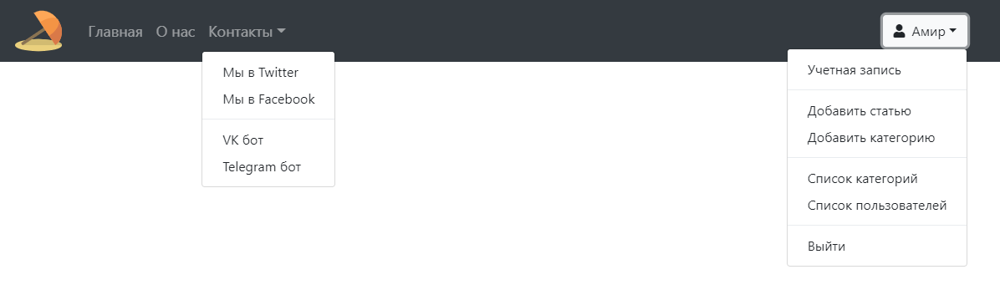
    
    Тематически сайт подразделяется на:
    
    * **Главная** - отображаются "карточки" мест с краткой информацией (поддерживается постраничная навигация):
    
        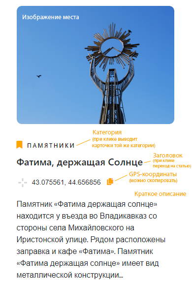
        
    * **О Нас** _(страница "О нас")_
   
    * **Контакты** _(выпадающее меню с ссылками на соцсети)_
    
    * **Вход** _(форма авторизации)_
    
    * **Выпадающее меню аккаунта**:
    
        * **Учетная запись** _(информация об акккаунте, разделенная на два пункта: **Профиль** (можно изменить) / **Дополнительная информация**)_
        
        * Если пользователь `админ`, то добавляются следуюшие пункты:
            - **Добавить статью** _(форма добавления статьи)_
            - **Добавить категорию** _(форма добавления категорию)_            
            - **Список категорий** - таблица категорий:
                * Возможна **сортировка по столбцам** _(просто кликните на заголовок столбца)_
                * Можно **удалить / отредактировать** статью                
            - **Список пользователей** - таблица пользователей:
                * Возможна **сортировка по столбцам** _(просто кликните на заголовок столбца)_
                * Можно **назначить любого пользователя** _(кроме себя)_ **админом** _(либо убрать его права)_
                
        * **Выйти** _(Выход из текущего аккаунта)_
        
2. Все активные ссылки делятся на 3 части:

    * Подстраницы
    
    * Функциональные элементы
    
    * Перекрёстные ссылки на другие сайты
    
3. Программная часть проекта

    * Серверные технологии (языки программирования)
    
        - Python (Flask) 
    
    * Клиентские технологии (языки разметки, клиентские языки программирования)
    
        - JavaScript
        
        - HTML
        
        - CSS
    
    * Системы управления базами данных (СУБД)
    
        - SQLite _(Flask-SQLAlchemy)_
        
4. Содержание и функционал сайта

    ### Для всех пользователей
    
    | Название раздела | Описание | Изображение |
    | :----------------: | -------- | :-----------: |
    | **Главная** | Представлены ‘карточки’ мест с краткой информацией: **категория** _(при клике выводятся карточки той же категории)_ и **название места**, **фото**, **gps – координаты**, **краткое описание**. **`Админу`** можно **добавить статью** и **просмотреть категории** _(см. кнопки)_; также можно **удалить** или **отредактировать** любую из статей | 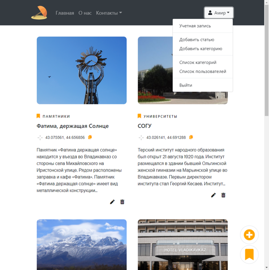 |
    | **Статья** | В статье можно **почитать информацию о месте**, **посмотреть его расположение на Яндекс Картах** и **проложить маршрут**, **прокомментировать статью**, **посмотреть рекомендованные посты** _(если постов на данную тему **> 3**)_ | 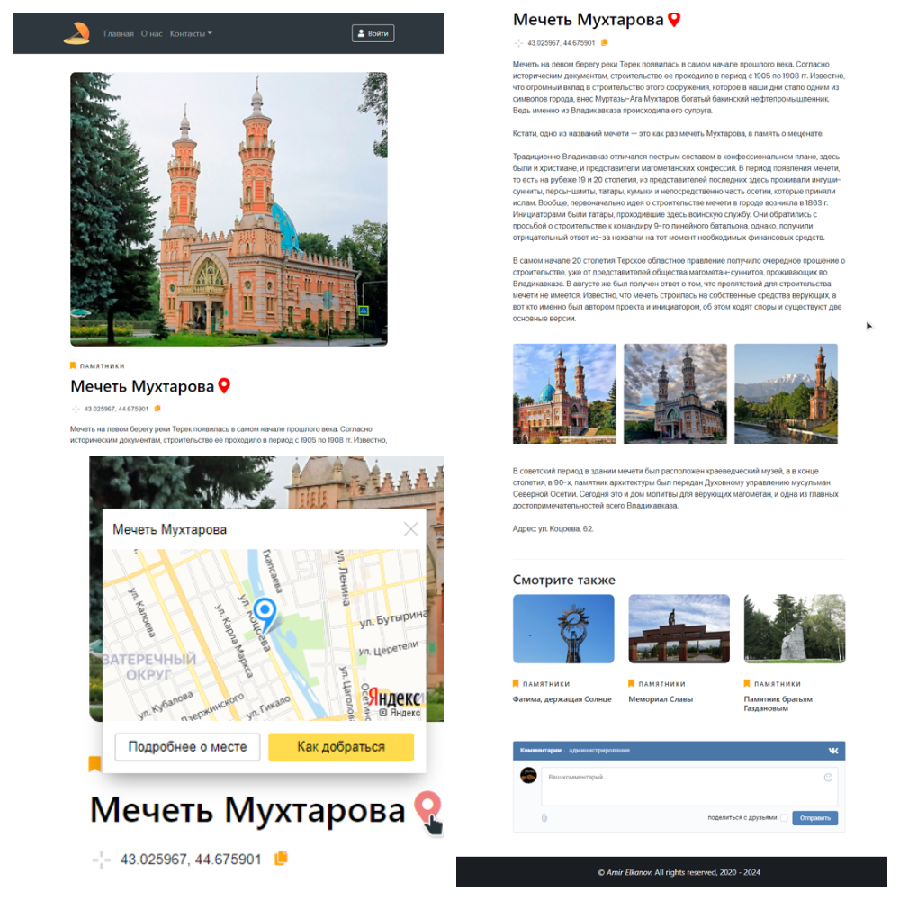 |
    | **О нас** | На данной странице можно **просмотреть информацию о сайте**, _но текста нет – стоит “заглушка”_ | 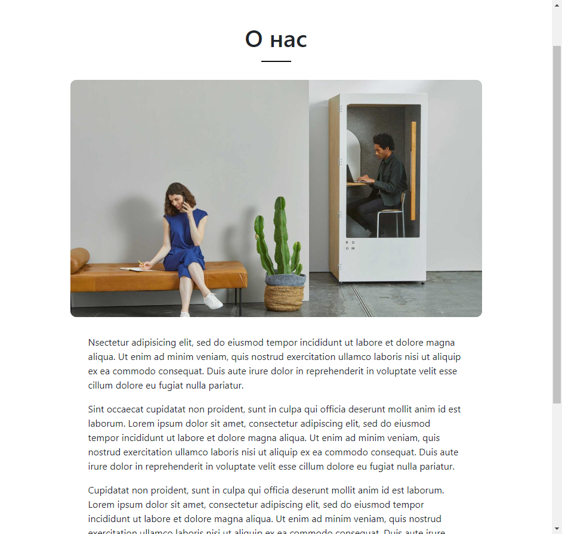 |
    | **Вход** | Форма **авторизации** пользователя | 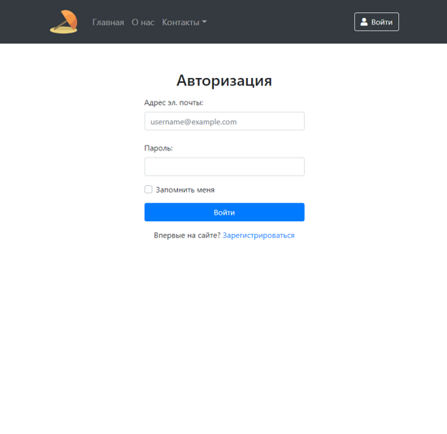 |
    | **Регистрация** | Форма **регистрации** пользователя | 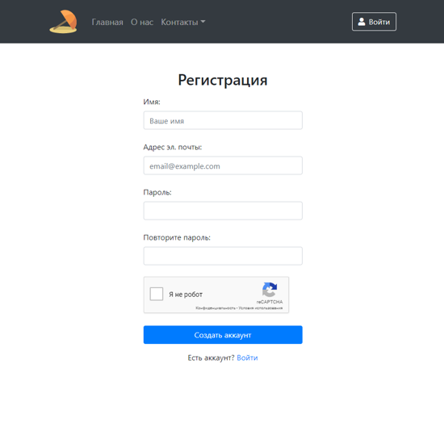 |
    | **Учетная запись** | На данной странице можно **узнать информацию об аккаунте**. _При нажатии на любой из пунктов “профиль”, откроется форма изменения данных._ | 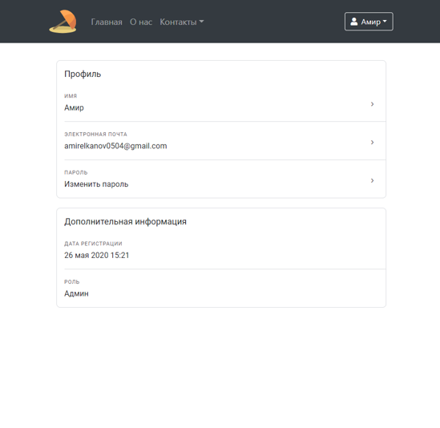 |
    | **Изменение данных аккаунта** | Данный раздел подразделяется на **3 формы**: `изменение имени / пароля / адреса эл. почты` | 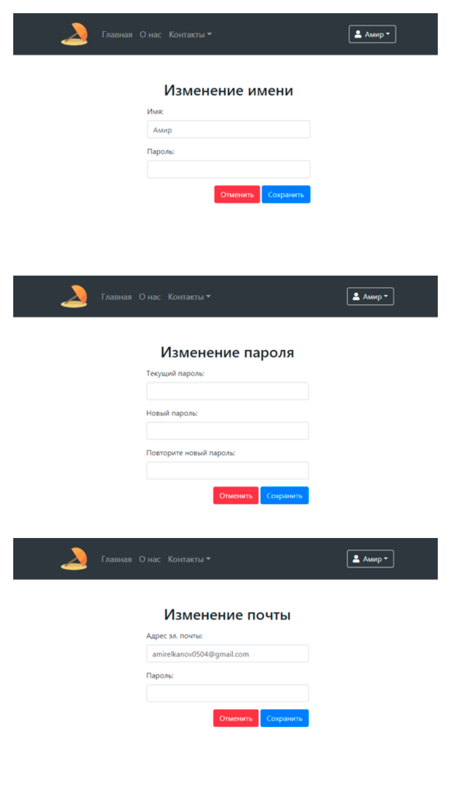 |
    |  |  |  |
    
    ### Функции админа

    | Название раздела | Описание | Изображение |
    | :----------------: | -------- | :-----------: |
    | **Добавление / редактирование статьи** | Форма **добавления** / **редактирования** статьи, на которой можно **прикрепить изображения** или даже **группу изображений** _(используя кнопки в поле ввода)_. [**Инструкция по добавлению статьи**](https://youtu.be/9Cz_M_ZCbAQ) | 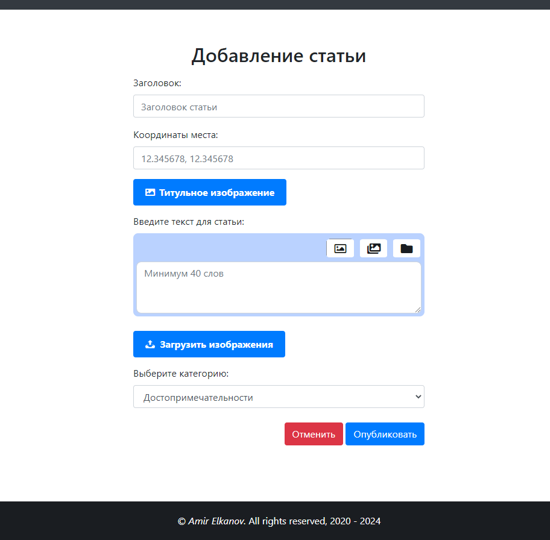 |
    | **Список категорий** | На данной странице можно **просмотреть список категорий** в виде _таблицы_, которую можно **отсортировать по столбцам** _(просто при нажатии на нужный)_. При наведении на строчку таблицы появляется два действия: **отредактировать** и **удалить статью**. | 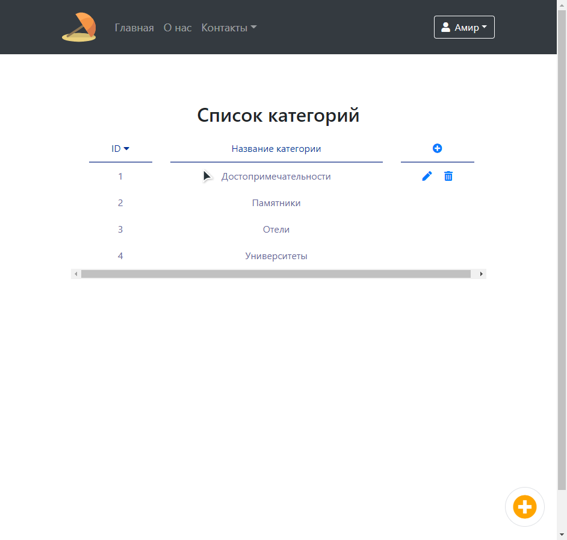 
    | **Добавление / редактирование категории** | Форма **добавления** / **редактирования** категории. | 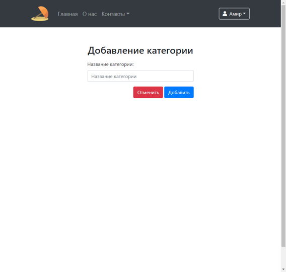 |
    | **Список пользователей** | На данной странице можно **просмотреть список пользователей** в виде таблицы, которую можно **отсортировать по столбцам** _(просто при нажатии на нужный)_. Также можно **изменять роль пользователя** _(`админ` / `не админ`)_ | 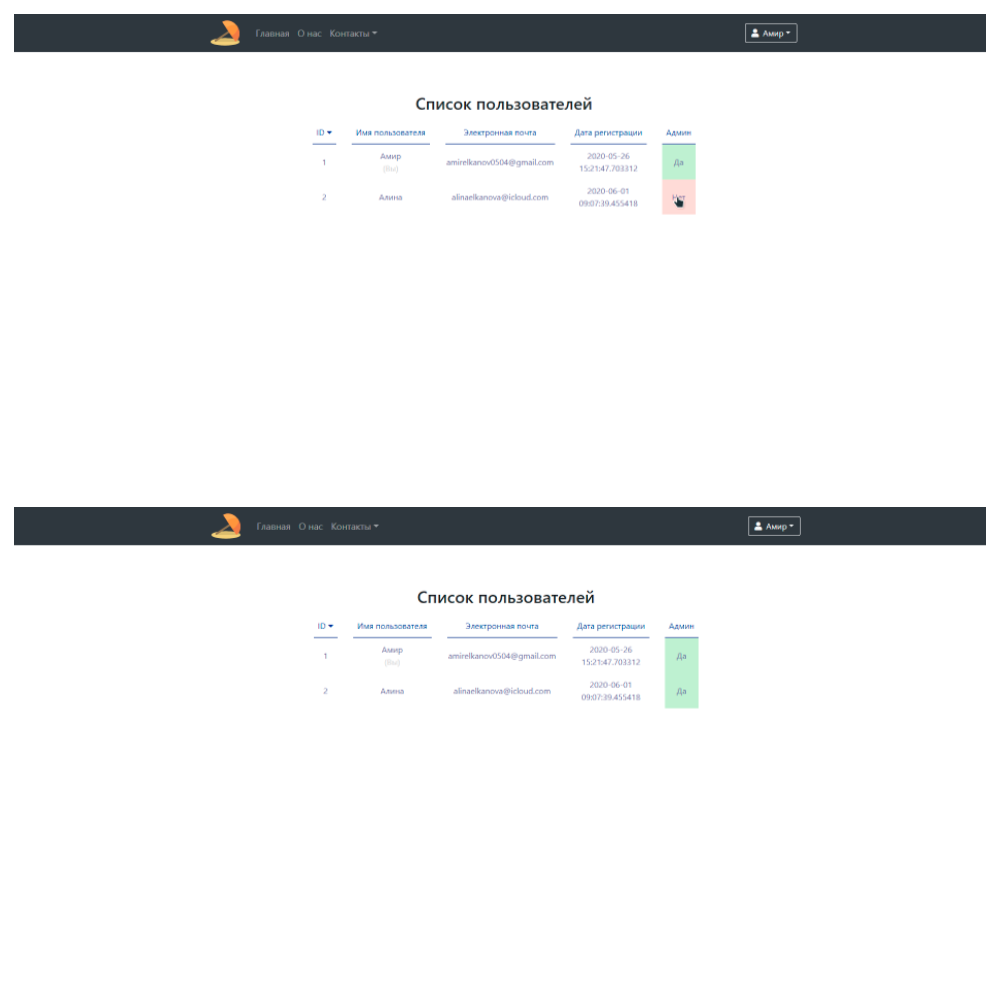 |
    |  |  |  |
    